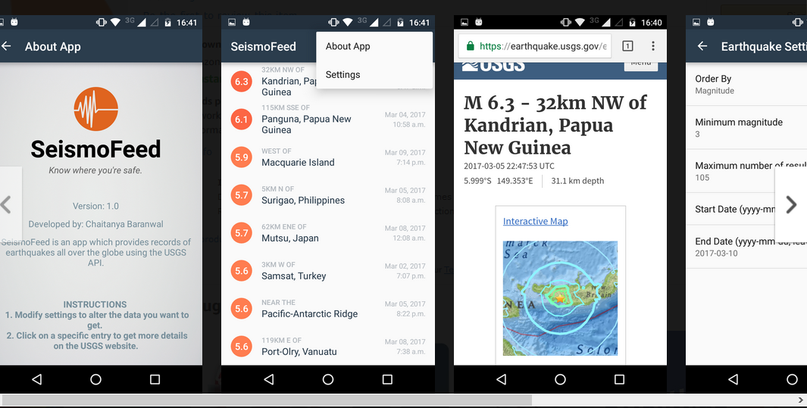

# SeismoFeed

SeismoFeed is an app which provides a database for all the earthquakes ever happened so you can make informed choices on the places you want to go to. It can be used for information purposes as well. It uses the USGS API to provide a list of earthquakes and the results can be altered by changing parameters such as minimum magnitude, sort by, and others. 

## Getting started

* Clone the repository, open the downloaded folder and build the application on `Android studio`.

## Prerequisites

* **To make changes and build the app**
  * `Android Studio`: You can go to https://developer.android.com/studio/index.html#downloads to download the platform. Prior knowledge of `Java` and the platform required to modify/build the app.
  
* **To run the downloaded app**
  * Go to https://www.amazon.com/DA-Apps-SeismoFeed/dp/B06XZ5J87K to download the app. This app runs only on Android, and thus an Android phone/emulator is required.
  
## Authors

* **Chaitanya Baranwal** (https://github.com/chaitanyabaranwal/)

